# 同梱プラグイン解説

`redmine-web` イメージに焼き込まれているプラグイン 15 個とテーマ 1 個を、画面の
スクリーンショット付きで解説します。対象は既定シリーズの **Redmine 7 系
（`Containerfile.v7`、Redmine 7.0.2）** です。5 系 / 6 系で版が異なるもの、同梱されない
もの（15 番は 7 系のみ）は各項目の「導入プラグインバージョン」に併記しています。

- プラグインの版の選定根拠（`requires_redmine` 宣言と CI 実績の調査結果）は
  [Design.md](Design.md)「Redmine シリーズの切り替え」を参照してください。
- 導入・更新の方法（Containerfile の編集と再ビルド）は [Manual.md](Manual.md) を参照してください。

> **スクリーンショットについて**
> `redmine_gtt` 以外の画面は、公式 `redmine:7.0.1` イメージに `Containerfile.v7` と同じ
> 版のプラグイン / テーマを載せた環境で、デモ用データ（サンプルプロジェクト、チケット
> 10 件、Wiki ページなど）を投入して撮影したものです（2026-09 撮影、表示言語は日本語）。
> そのため全画面の上部にサイト全体バナー（redmine_banner）が、プロジェクト画面には
> プロジェクトバナーが表示されています。
> `redmine_gtt` の画面は、プラグインのリポジトリ（v7.1.0）の `doc/` に同梱されている
> 公式スクリーンショットをそのまま転載しています（英語表示）。

## 目次

| # | プラグイン | 7 系の版 | 主な用途 |
|---|---|---|---|
| 1 | [redmine_wiki_lists](#1-redmine_wiki_lists) | 0.0.11 | Wiki にチケット一覧・ページ一覧を埋め込むマクロ |
| 2 | [redmine_banner](#2-redmine_banner) | master（表示上 0.3.4） | サイト全体 / プロジェクト単位のお知らせバナー |
| 3 | [redmine_issues_panel](#3-redmine_issues_panel) | 1.2.1 | かんばん形式のチケットパネル |
| 4 | [redmica_ui_extension](#4-redmica_ui_extension) | 0.6.0 | 検索可能なセレクトボックス、バーンダウンチャート、mermaid など |
| 5 | [redmine_ip_filter](#5-redmine_ip_filter) | 1.2.0 | IP アドレスによるアクセス制限 |
| 6 | [redmine_message_customize](#6-redmine_message_customize) | 1.1.0 | 画面の文言（翻訳）を管理画面から変更 |
| 7 | [redmine_issue_templates](#7-redmine_issue_templates) | 1.2.2（master） | チケット / コメントのテンプレート |
| 8 | [view_customize](#8-view_customize) | 3.6.0 | JavaScript / CSS / HTML の埋め込みによる画面カスタマイズ |
| 9 | [redmine_logs](#9-redmine_logs) | 0.4.0 | 管理画面からログファイルを閲覧・ダウンロード |
| 10 | [redmine_login_audit2](#10-redmine_login_audit2) | 1.0.2 | ログイン / API アクセスの監査ログ |
| 11 | [redmine_wiki_extensions](#11-redmine_wiki_extensions) | 1.3.0 | Wiki のコメント・タグ・投票・各種マクロ |
| 12 | [redmine_solid_queue](#12-redmine_solid_queue) | 1.0.0 | バックグラウンドジョブ（メール送信など）を Solid Queue で処理 |
| 13 | [redmine_gtt](#13-redmine_gtt) | 7.1.0 | チケットへの位置情報付与と地図表示（PostGIS 必須） |
| 14 | [redmine_xlsx_format_issue_exporter](#14-redmine_xlsx_format_issue_exporter) | 0.2.1 | 一覧の XLSX（Excel）出力 |
| 15 | [redmine_cascading_custom_fields](#15-redmine_cascading_custom_fields) | 0.2.0（v0.2.0、7 系のみ） | 親リストの値で子リストの選択肢を絞り込むカスタムフィールド |
| – | [farend_fancy（テーマ）](#テーマ-farend_fancy) | master | アイコン付きの見やすいテーマ |

「対応 Redmine バージョン」は、各プラグインの `init.rb` にある `requires_redmine` の宣言と、
CI（自動テスト）の対象バージョンを記載しています。宣言だけで CI 実績のないものは、
本番投入前に動作確認してください。

### 管理画面のメニュー

プラグインを入れると、管理画面のサイドメニューに次の項目が追加されます
（「バナー」「IPアドレスフィルター」「グローバル チケットテンプレート」「ログイン監査」
「ログ」「メッセージのカスタマイズ」「表示のカスタマイズ」。`redmine_cascading_custom_fields` は管理画面のメニューではなく、カスタムフィールドの形式に「リスト（カスケード）」を追加します。`redmine_gtt` を含むイメージでは
「地図レイヤー」「地図の設定」も追加されます）。管理 → 情報 では、導入されている
プラグインとその版を確認できます。

管理 → プラグイン の一覧（このスクリーンショットの環境には `redmine_gtt` を載せていないため
13 個です。実際のイメージでは 15 個表示されます）:

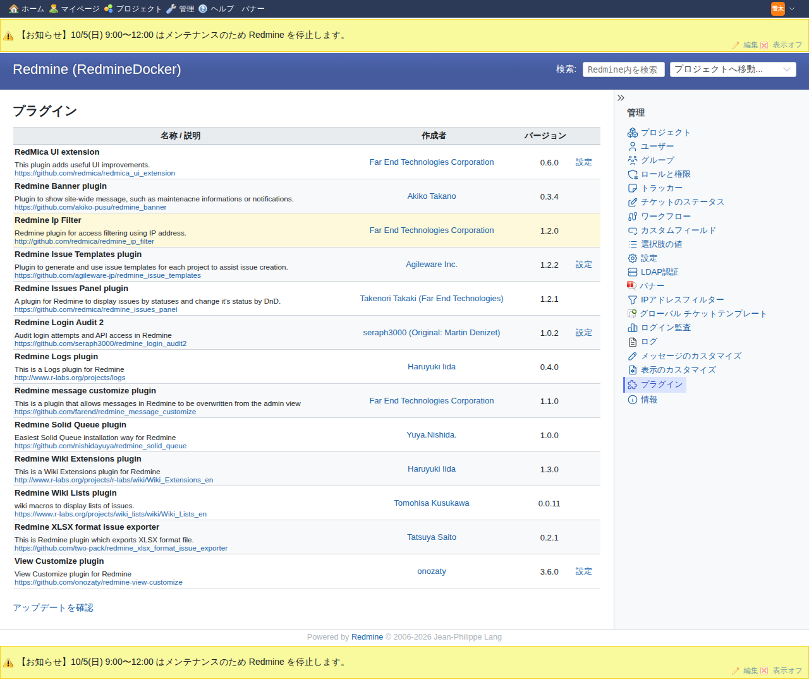

---

## 1. redmine_wiki_lists

| 項目 | 内容 |
|---|---|
| プラグインタイトル | Redmine Wiki Lists plugin |
| リポジトリ | <https://github.com/tkusukawa/redmine_wiki_lists> |
| 導入プラグインバージョン | 7 系: **0.0.11** / 6 系: 0.0.11 / 5 系: 0.0.11 |
| 対応 Redmine バージョン | `requires_redmine 3.4` 以上（上限なし）。最終更新は 2021 年で、Redmine 7 での CI 実績はありません |

### 解説

Wiki（およびチケットの説明など Wiki 記法が使える場所）に、条件に合うチケットの一覧や
Wiki ページの一覧を埋め込むマクロを追加します。「未完了のバグ一覧」「子ページの目次」
のような、常に最新の状態で表示される一覧表を Wiki に置けます。

| マクロ | 内容 |
|---|---|
| `{{ref_issues(オプション..., 列...)}}` | 条件に合うチケットを一覧表示します。`-f:フィルタ=値` で絞り込み（例: `-f:tracker_id=1`）、`-f:status_id o` のように演算子も指定できます。`-q=カスタムクエリ名` / `-i=クエリID` で保存済みクエリを使えます。`-c` は件数のみ表示。列には `id`, `subject`, `status`, `assigned_to` などを指定します |
| `{{wiki_list(オプション..., 列...)}}` | Wiki ページを一覧表示します。`-c` で子ページに限定、`-p=プロジェクト名` でプロジェクトを指定。列 `+title` はページ名、`キーワード\終端文字` はページ本文からキーワードの後ろの文字列を抜き出して表示します |
| `{{issue_name_link(題名)}}` | チケットの **題名** でチケットへのリンクを作ります |

記述例（スクリーンショットの Wiki ページ）:

```
{{ref_issues(-f:tracker_id=1, -f:status_id o, id, subject, status, assigned_to)}}

{{wiki_list(-c, +title|ページ名, 概要:\。|概要)}}
```

> ヒント: `wiki_list` のキーワード抽出は、`キーワード\終端文字` の形で終端を指定すると
> 確実です（例では各ページに「概要: ～。」と書き、`。` を終端にしています）。

### スクリーンショット

`ref_issues` による未完了バグ一覧と、`wiki_list` による子ページ一覧:

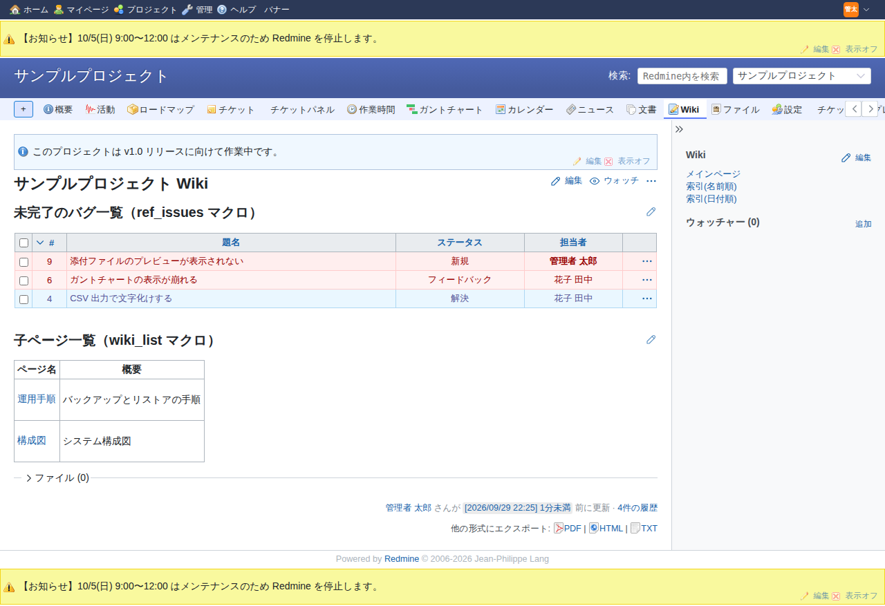

---

## 2. redmine_banner

| 項目 | 内容 |
|---|---|
| プラグインタイトル | Redmine Banner plugin |
| リポジトリ | <https://github.com/agileware-jp/redmine_banner> |
| 導入プラグインバージョン | 7 系: **master**（管理画面の表示は 0.3.4）/ 6 系: 0.3.5 / 5 系: 0.3.5 |
| 対応 Redmine バージョン | `requires_redmine 4.0` 以上。Redmine 7 対応（Rails 8.1 でのルーティング例外の修正、アイコン CSS の修正）は最新タグ 0.3.5 より後の master にのみ含まれるため、7 系は master を固定しています（PR #15、2026-08-25 マージ） |

### 解説

メンテナンス予告などのお知らせを、画面上部（および下部）に帯状のバナーとして表示します。

- **サイト全体バナー**: 管理 → バナー（または上部メニューの「バナー」）で設定します。
  - 表示対象（全員 / ログインユーザーのみ）、メッセージタイプ（Info / Warn / Alert / Normal）、
    表示位置（ヘッダ / フッタ / 両方）、ログインページのみに表示、関連リンクを設定できます。
  - **タイマー**を有効にすると、指定した期間だけ表示できます。
  - 「バナー管理者グループ」に所属するユーザーは、システム管理者でなくてもサイト全体
    バナーを編集できます。
- **プロジェクトバナー**: プロジェクトの設定 → モジュールで「バナー」を有効にすると、
  プロジェクトメニューに「バナー」が現れ、そのプロジェクトの画面だけに表示するバナーを
  設定できます（「バナーの管理」権限が必要。タイマーは非対応、表示位置は上部のみ）。
- バナー右下の「表示オフ」で、利用者は自分の画面からバナーを一時的に消せます。

### スクリーンショット

サイト全体バナー（黄色、Warn）とプロジェクトバナー（青、Info）の表示例:

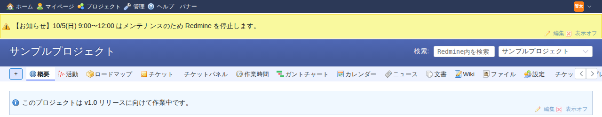

サイト全体バナーの設定画面（管理 → バナー）:

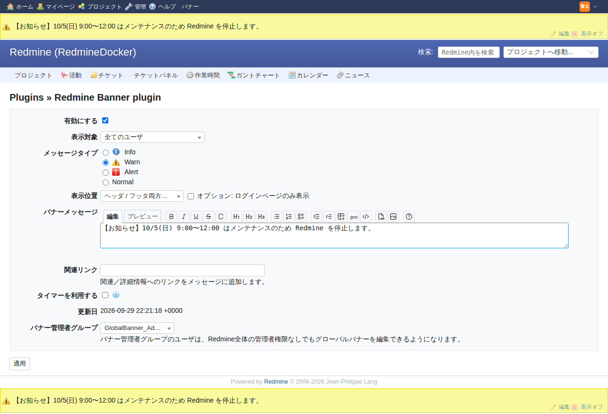

プロジェクトバナーの設定画面（プロジェクト → バナー）:

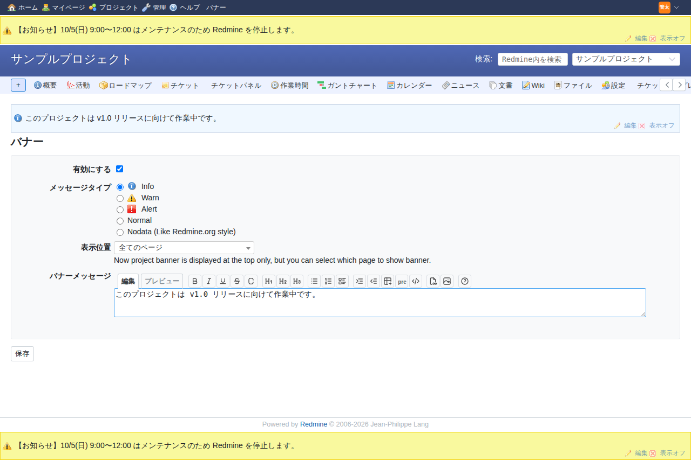

---

## 3. redmine_issues_panel

| 項目 | 内容 |
|---|---|
| プラグインタイトル | Redmine Issues Panel plugin |
| リポジトリ | <https://github.com/redmica/redmine_issues_panel> |
| 導入プラグインバージョン | 7 系: **1.2.1** / 6 系: 1.2.1 / 5 系: 1.0.4 |
| 対応 Redmine バージョン | 1.2.1 は `requires_redmine 6.0` 以上。CI は redmine/redmine の master（= 7.0 開発版）を対象（5 系の 1.0.4 は RedMica 3.0 = Redmine 5.1 相当で CI 実績あり） |

### 解説

チケットをステータスごとの列に並べた **かんばん形式の「チケットパネル」** を追加します。

- カードを別の列へ **ドラッグ＆ドロップするとステータスが変わります**（ワークフローの
  設定に従います）。
- チケット一覧と同じフィルタ / グループ化 / カスタムクエリで表示対象を絞り込めます。
- カード右上の「…」から、チケット一覧と同じコンテキストメニューで担当者や優先度を変更できます。
- 列見出しの「＋」や列下部の「新しいチケット」から、そのステータスでチケットを作成できます。

有効化: プロジェクトの設定 → モジュールで **「チケットパネル」** にチェックを入れます。
プロジェクトメニューに「チケットパネル」タブが追加されます。

### スクリーンショット

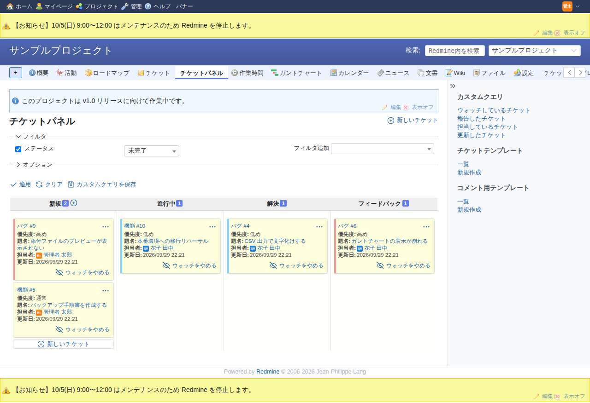

---

## 4. redmica_ui_extension

| 項目 | 内容 |
|---|---|
| プラグインタイトル | RedMica UI extension |
| リポジトリ | <https://github.com/redmica/redmica_ui_extension> |
| 導入プラグインバージョン | 7 系: **0.6.0** / 6 系: 0.6.0 / 5 系: 0.3.10 |
| 対応 Redmine バージョン | 0.6.0 は `requires_redmine 6.0` 以上。CI は redmine/redmine の master（= 7.0 開発版）を対象 |

### 解説

Redmine 本体では実現しにくい UI の改善をまとめたプラグインです（RedMica 由来の機能）。
各機能は 管理 → プラグイン → RedMica UI extension の「設定」で個別に無効化できます。

| 機能 | 内容 |
|---|---|
| 検索可能なセレクトボックス | チケットのフィルタや入力フォームのセレクトボックスを Select2 に置き換え、文字を入力して候補を絞り込めるようにします。担当者やプロジェクトが多い環境で便利です |
| バーンダウンチャート | ロードマップのバージョン詳細画面に、残チケット数の推移と理想線のバーンダウンチャートを表示します |
| mermaid マクロ | `{{mermaid ... }}` で囲んだ Mermaid 記法のテキストを、フローチャートやシーケンス図などの図として表示します（Wiki・チケットなどで使用可） |
| 添付ファイルのプレビュー | 画像・音声・動画・PDF の添付ファイルを、画面遷移せずにプレビューできます |

mermaid マクロの記述例:

```
{{mermaid
flowchart LR
    client[クライアント] -->|443| apache[ホスト Apache]
    apache -->|/redmine| web[redmine-web]
    web --> db[(redmine-db PostgreSQL)]
}}
```

### スクリーンショット

検索可能なセレクトボックス（チケット一覧の担当者フィルタで「田中」と入力して絞り込み）:

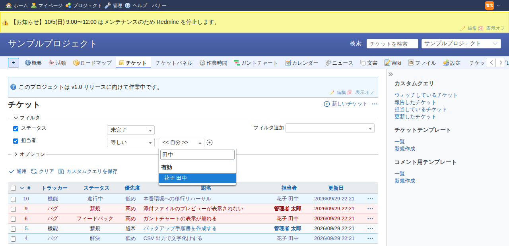

バージョン詳細画面のバーンダウンチャート:

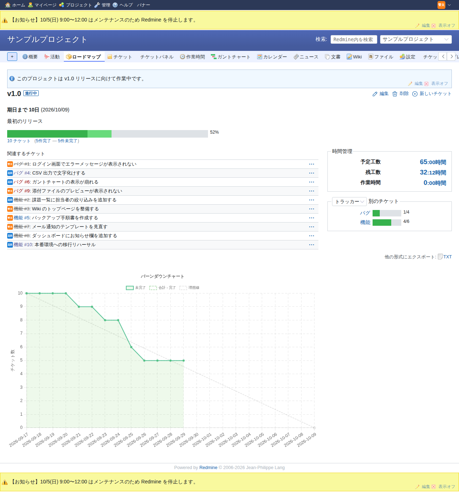

mermaid マクロで描いた構成図:

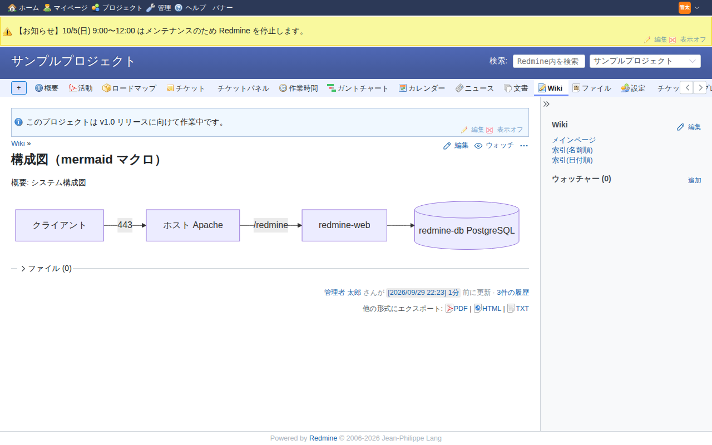

プラグイン設定（機能ごとの有効 / 無効）:

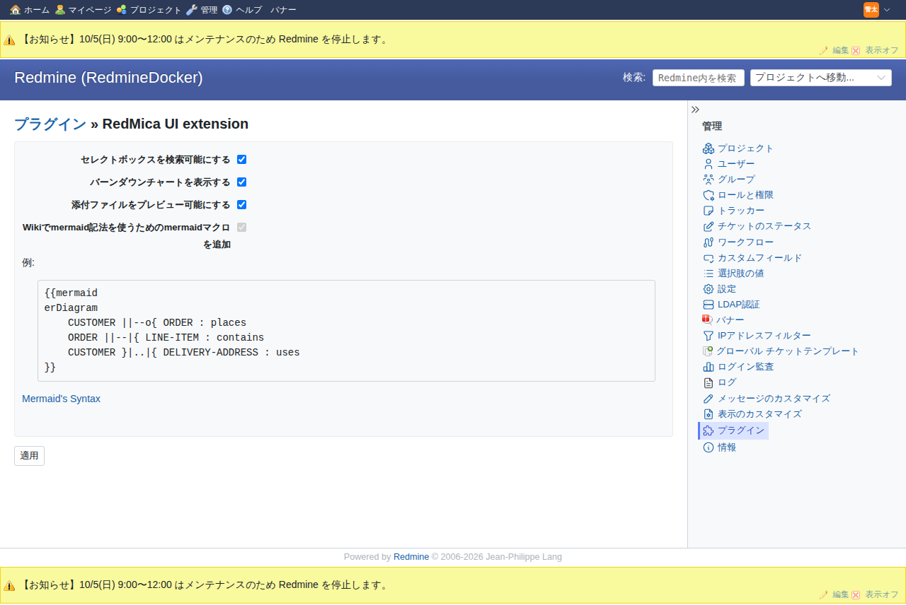

---

## 5. redmine_ip_filter

| 項目 | 内容 |
|---|---|
| プラグインタイトル | Redmine Ip Filter |
| リポジトリ | <https://github.com/redmica/redmine_ip_filter> |
| 導入プラグインバージョン | 7 系: **1.2.0** / 6 系: 1.1.1 / 5 系: 1.1.0 |
| 対応 Redmine バージョン | `requires_redmine 4.1` 以上。1.2.0 の CI は redmine/redmine の master（= 7.0 開発版）を対象 |

### 解説

アクセス元の IP アドレスで、Redmine サイトへのアクセスを制限します。

- 管理 → **IPアドレスフィルター** に、アクセスを許可する IP アドレスを 1 行に 1 つ登録します。
  単独のアドレス（`198.51.100.10`）、CIDR 表記（`192.0.2.0/28`）、サブネットマスク表記
  （`192.0.2.0/255.255.255.240`）が使えます。`#` 以降はコメントです（最大 100 件）。
- 許可リストが **空のときは全てのアクセスを許可** します。
- 設定を保存する管理者が現在接続している IP アドレスをリストに含めないと保存できません
  （「アクセス許可IPアドレスは現在接続中のIPアドレス (…) を含まなければなりません」。
  自分を締め出さないための保護です）。
- 許可されていない IP アドレスからのアクセスは拒否され、Redmine のログに
  `redmine_ip_filter: rejected access from …` が記録されます。

> **本スタックでの注意**: `redmine-web` の前段にはホスト Apache（TLS 終端）とコンテナ内
> Apache があり、Redmine から見えるアクセス元 IP はリバースプロキシのアドレスになる場合が
> あります。ルールを登録する前に、ログイン監査（[10](#10-redmine_login_audit2)）の
> 「IPアドレス」欄などで Redmine が実際に認識しているアドレスを確認してください。

### スクリーンショット

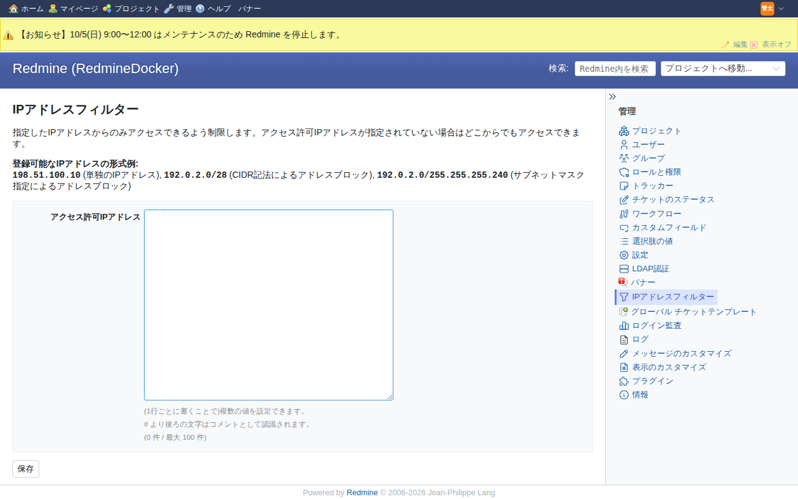

---

## 6. redmine_message_customize

| 項目 | 内容 |
|---|---|
| プラグインタイトル | Redmine message customize plugin |
| リポジトリ | <https://github.com/farend/redmine_message_customize> |
| 導入プラグインバージョン | 7 系: **1.1.0** / 6 系: 1.1.0 / 5 系: 1.0.1 |
| 対応 Redmine バージョン | 1.1.0 は `requires_redmine 6.0` 以上。最終更新は 2024-11 で、Redmine 7 に対する CI 実績はありません |

### 解説

Redmine の画面に表示される文言（`config/locales/*.yml` で定義された翻訳）を、
ソースを編集せずに管理画面から書き換えます。「チケット」を「課題」に言い換える、
といった組織内の用語に合わせる用途に使えます。

- 管理 → **メッセージのカスタマイズ** で設定します。
- **通常モード**: 言語を選び、「変更したい文言を選択してください」の検索ボックスから
  キー（例: `label_issue_plural`）や現在の文言で検索して、新しい文言を入力します。
- **YAML モード**: 変更内容を YAML でまとめて編集できます。
- 「カスタマイズを無効にする」で一時的に元の文言へ戻せます。「デフォルトのメッセージを
  確認する」で元の文言を参照できます。

### スクリーンショット

設定画面（`label_issue_plural` を「チケット（全件）」、`label_issue_new` を「チケットを起票」に変更）:

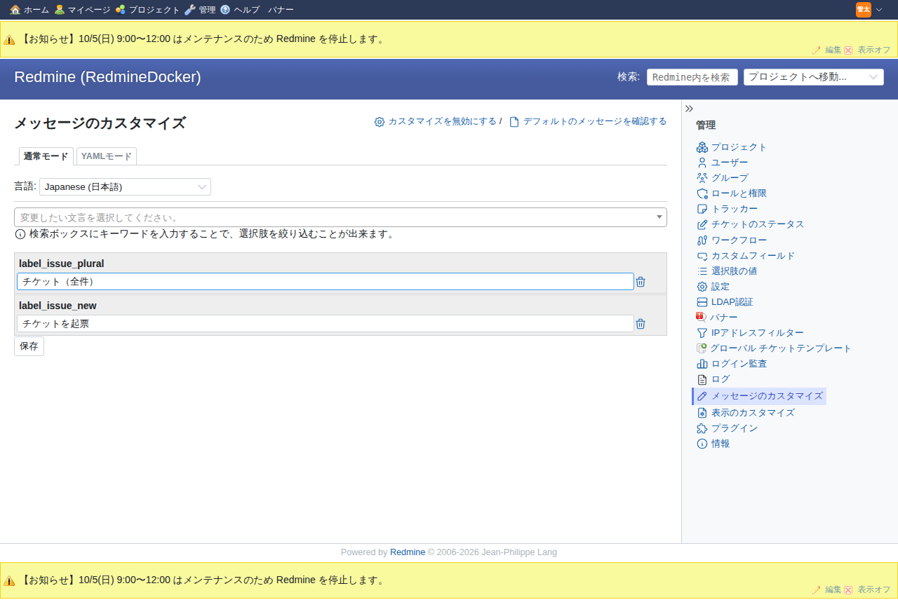

変更後の画面（タブ名・見出し・右上のリンクの文言が変わっています）:

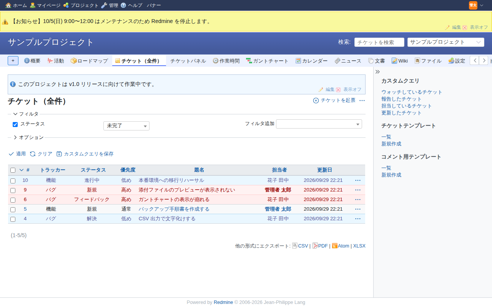

---

## 7. redmine_issue_templates

| 項目 | 内容 |
|---|---|
| プラグインタイトル | Redmine Issue Templates plugin |
| リポジトリ | <https://github.com/redmica/redmine_issue_templates>（元は agileware-jp / akiko-pusu） |
| 導入プラグインバージョン | 7 系: **1.2.2**（master）/ 6 系: 1.2.2（master）/ 5 系: 1.2.2（master） |
| 対応 Redmine バージョン | `requires_redmine 4.0` 以上。master には Redmine 7.0 向けのアイコン互換対応（legacy-icons-compat.css の読み込み）が入っています |

### 解説

チケット作成時に、トラッカーごとに用意した **定型文（テンプレート）** を題名・説明欄へ
挿入できるようにします。バグ報告の「発生手順 / 期待する結果 / 実際の結果」のような
書式を統一するのに役立ちます。

- **チケットテンプレート**: プロジェクトのメニュー「チケットテンプレート」（または
  チケット画面の右サイドバー）から、トラッカーごとに作成します。「デフォルト値」に
  したテンプレートは、新規チケット画面を開いたときに自動で適用されます。
- **グローバル チケットテンプレート**: 管理 → グローバル チケットテンプレート で、
  複数プロジェクトで共通に使うテンプレートを作成できます。
- **コメント用テンプレート**: チケット更新時の注記（コメント）用テンプレートも作成できます。
- 有効化: プロジェクトの設定 → モジュールで **「チケットテンプレート」** にチェックを入れます。

新規チケット画面では「チケットテンプレート」のプルダウンでテンプレートを選択でき、
「テンプレートの内容を確認」「タイトルと詳細をクリア」「テンプレート適用前に戻す」も
使えます。

### スクリーンショット

プロジェクトのテンプレート一覧:

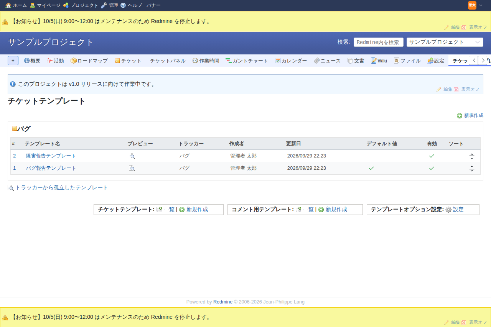

新規チケット画面（トラッカー「バグ」のデフォルトテンプレートが自動で適用された状態）:

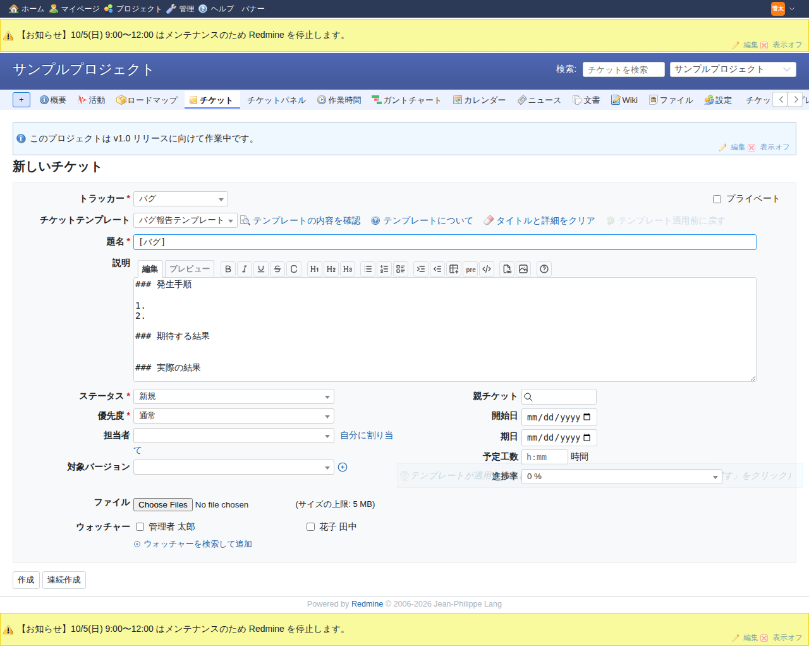

---

## 8. view_customize

| 項目 | 内容 |
|---|---|
| プラグインタイトル | View Customize plugin |
| リポジトリ | <https://github.com/onozaty/redmine-view-customize> |
| 導入プラグインバージョン | 7 系: **3.6.0** / 6 系: master / 5 系: 3.6.0 |
| 対応 Redmine バージョン | `requires_redmine 4.0.0` 以上。3.6.0 には Redmine 7.0 の非推奨警告（ActiveSupport::Configurable）への対応が入っています |

### 解説

条件に一致した画面に **JavaScript / CSS / HTML を埋め込んで**、画面をカスタマイズします。
プラグインを自作せずに「特定のフィールドを隠す」「注意書きを出す」「入力値をチェックする」
といった調整ができます。

管理 → **表示のカスタマイズ** で登録します。主な項目:

| 項目 | 内容 |
|---|---|
| パスのパターン | 対象ページのパスを正規表現で指定（例: `/issues$` = チケット一覧、`/issues/[0-9]+` = チケット詳細） |
| プロジェクトのパターン | 対象プロジェクトの識別子を正規表現で指定 |
| 挿入位置 | 全ページのヘッダ / チケット入力欄の下 / チケット詳細の下 / 全ページの末尾 / チケット一覧のコンテキストメニュー |
| 種別 | JavaScript / CSS / HTML |
| コード・コメント | 埋め込むコードと、一覧に表示される説明 |
| プライベート | 自分だけに適用するカスタマイズにする |

パターンを両方とも空にすると全ページが対象になります。

> 注意: 埋め込んだコードは Redmine 本体の画面構造（HTML の id / class）に依存します。
> Redmine のメジャーバージョンを上げたときは、カスタマイズが動作するか確認してください。
> なお、このプラグインのディレクトリ名は必ず `view_customize` である必要があります
> （Containerfile で対応済み）。

### スクリーンショット

カスタマイズ一覧（チケット詳細に注意書きを出す JavaScript と、一覧の優先度「高め」を太字にする CSS）:

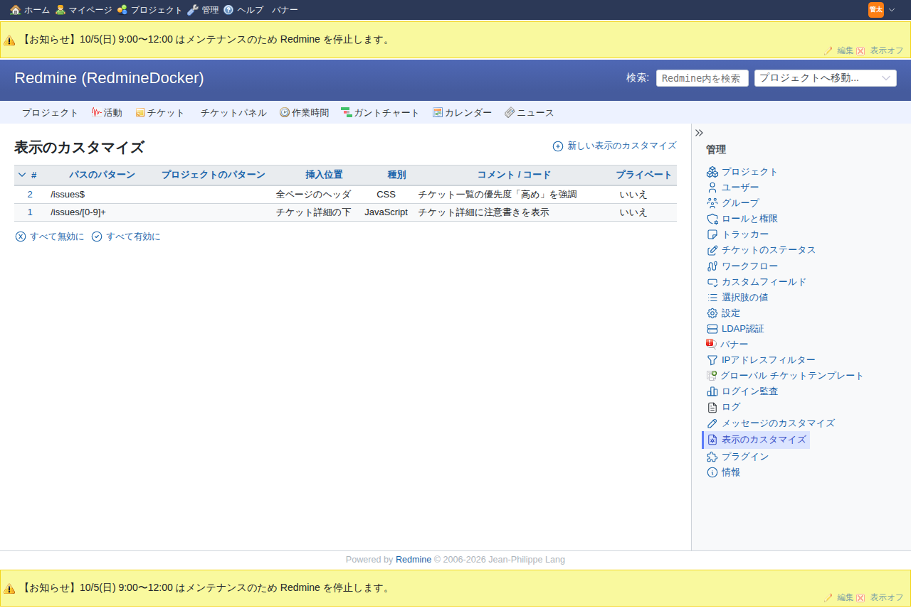

適用結果（チケット詳細の上部に注意書きが追加されています）:

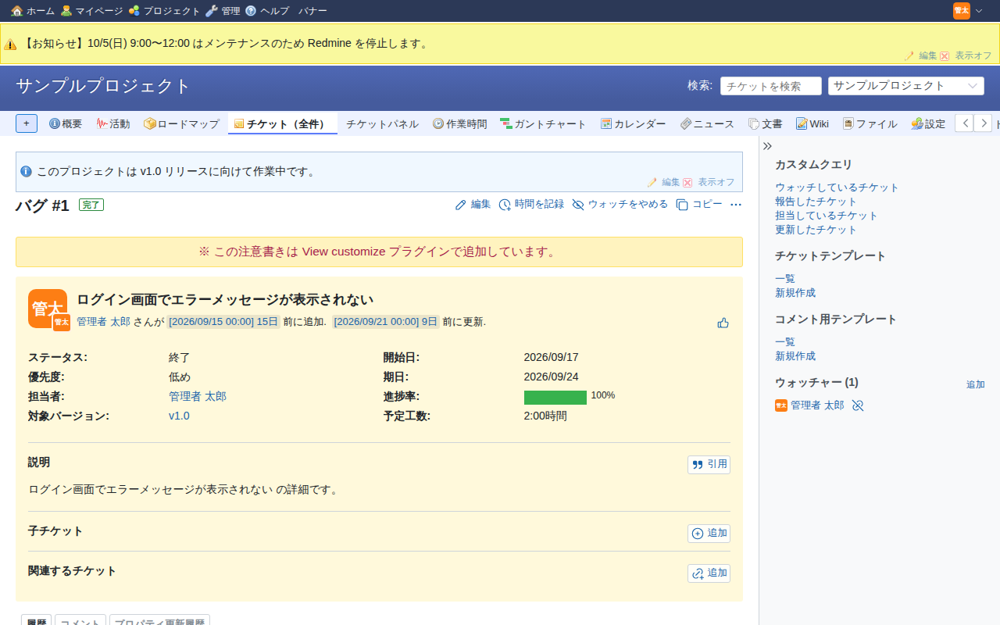

---

## 9. redmine_logs

| 項目 | 内容 |
|---|---|
| プラグインタイトル | Redmine Logs plugin |
| リポジトリ | <https://github.com/haru/redmine_logs> |
| 導入プラグインバージョン | 7 系: **0.4.0** / 6 系: 0.4.0 / 5 系: 0.3.0 |
| 対応 Redmine バージョン | 0.4.0 は `requires_redmine 6.0.0` 以上。CI の対象は 6.0-stable / 6.1-stable / master で、7.0-stable は含まれていません |

### 解説

管理 → **ログ** に、Redmine の `log/` ディレクトリにあるログファイルの一覧を表示し、
ブラウザから内容の閲覧・ダウンロード・削除ができるようにします。サーバーにログインせずに
エラーの調査ができます。

> **本スタックでの注意**: このスタックは公式イメージの既定どおり `RAILS_LOG_TO_STDOUT=true`
> で Rails のログをコンテナの標準出力（`docker compose logs`）に出しているため、
> `log/production.log` は書かれず、**既定ではこの画面の一覧は空** です。
> この画面でログを見たい場合は、[Manual.md](Manual.md)「ログ」の手順で `.env` に
> `RAILS_LOG_TO_STDOUT=`（空）を設定し、ファイル出力に切り替えてください（本番では
> `/opt/redmine/data/redmine/log` に書かれます）。下のスクリーンショットは、説明用に
> `log/production.log` を置いた状態で撮影しています。

### スクリーンショット

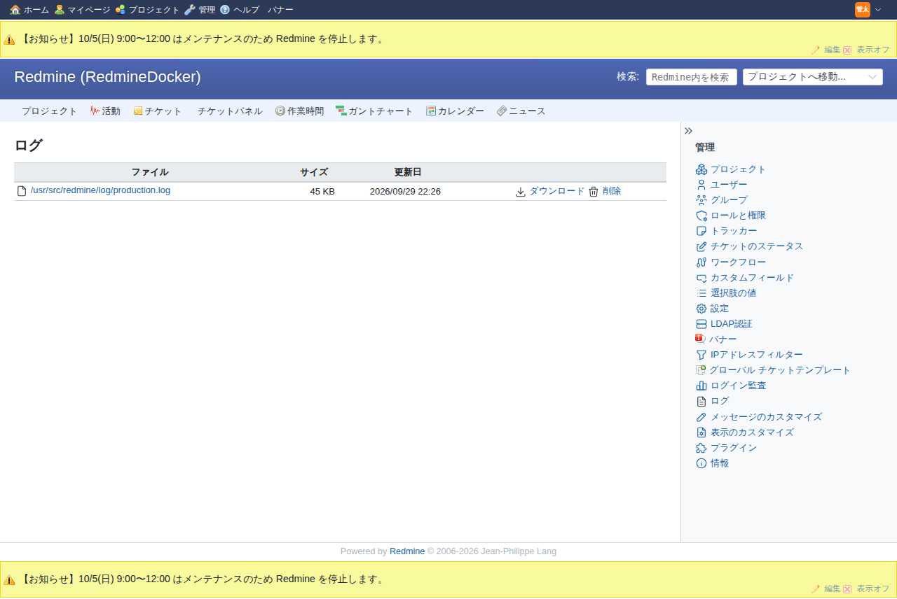

---

## 10. redmine_login_audit2

| 項目 | 内容 |
|---|---|
| プラグインタイトル | Redmine Login Audit 2 |
| リポジトリ | <https://github.com/seraph3000/redmine_login_audit2> |
| 導入プラグインバージョン | 7 系: **1.0.2** / 6 系: 1.0.0 / 5 系: **同梱なし**（全版が Redmine 6.0 以上を要求） |
| 対応 Redmine バージョン | `requires_redmine 6.0.0` 以上。1.0.2 は "Redmine 7.0 support" 対応版 |

### 解説

Web 画面からのログイン（成功 / 失敗）と REST API の認証アクセスを記録し、管理画面で
確認できるようにします（redmine_login_audit を Redmine 6 / 7 向けに作り直したもの）。

- 管理 → **ログイン監査** に、日時・ログイン ID・ユーザー・IP アドレス・成否・ソース
  （WEB / API）・メソッド・URL を一覧表示します。失敗したログインは赤く表示されます。
- フィルタ・並べ替え、**CSV エクスポート**、「統計」画面での集計ができます。
- 「古いログの削除」で、指定した月数より古いログを一括削除できます（誤操作防止の確認付き）。
  コマンドラインからは `bundle exec rake redmine_login_audit2:purge MONTHS=6` でも削除できます。
- 設定は 管理 → プラグイン → Redmine Login Audit 2 の「設定」で行います。

### スクリーンショット

誤ったパスワードによる失敗 1 件と、成功 2 件が記録された例:

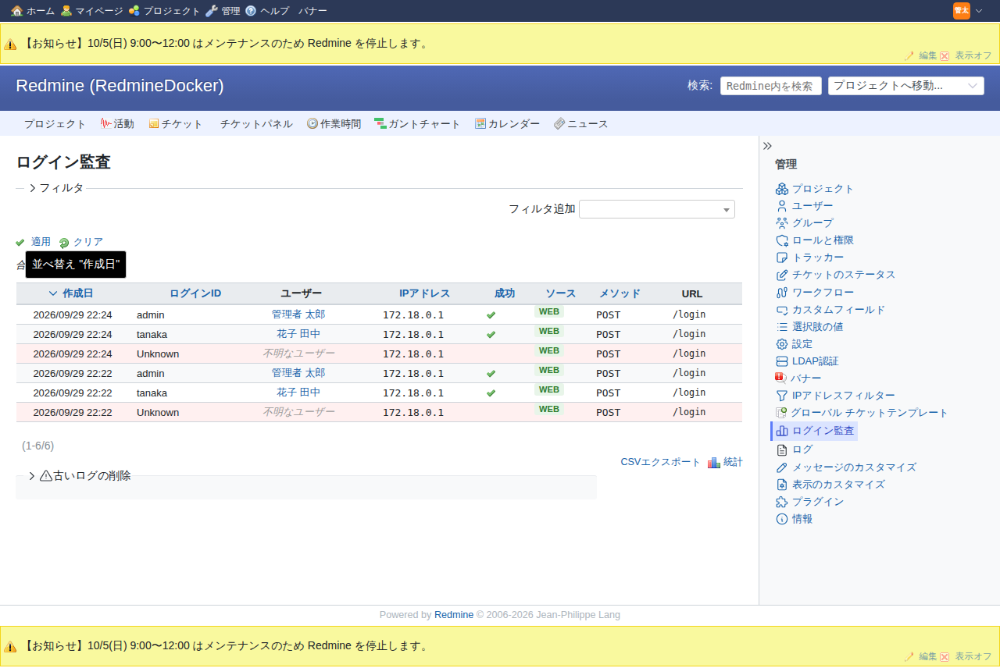

---

## 11. redmine_wiki_extensions

| 項目 | 内容 |
|---|---|
| プラグインタイトル | Redmine Wiki Extensions plugin |
| リポジトリ | <https://github.com/haru/redmine_wiki_extensions> |
| 導入プラグインバージョン | 7 系: **1.3.0** / 6 系: 1.2.0 / 5 系: 0.9.5 |
| 対応 Redmine バージョン | 1.3.0 は `requires_redmine 6.0.0` 以上。CI マトリクスに 7.0-stable と Ruby 4.0 が含まれています |

### 解説

Wiki にコメント・タグ・投票などの機能と、多数のマクロを追加します。
プロジェクトの設定 → モジュールで **「Wiki extensions」** を有効にして使います。

主なマクロ:

| マクロ | 内容 |
|---|---|
| `{{comment_form}}` / `{{comments}}` | ページにコメント欄を設置し、コメント（返信・編集・削除可）を表示します |
| `{{tags}}` / `{{tagcloud}}` / `{{taggedpages(タグ)}}` | ページのタグ表示・タグクラウド・タグの付いたページ一覧 |
| `{{vote(キー)}}` / `{{show_vote(キー)}}` | 投票ボタンと得票数 |
| `{{count}}` / `{{show_count}}` / `{{popularity}}` | ページの閲覧数の記録・表示、閲覧数ランキング |
| `{{recent(件数)}}` | 最近更新されたページの一覧 |
| `{{new(日付)}}` | 指定日から一定期間「New!!!」マークを表示 |
| `{{lastupdated_at}}` / `{{lastupdated_by}}` | ページの最終更新日時 / 更新者 |
| `{{fn(注釈)}}` / `{{fnlist}}` | 脚注 |
| `{{wiki(プロジェクト,ページ)}}` / `{{project(プロジェクト)}}` | 他プロジェクトの Wiki ページ / プロジェクトへのリンク |
| `{{iframe(URL)}}` / `{{video_tag(URL)}}` / `{{twitter(ユーザー)}}` | 外部コンテンツの埋め込み |
| `{{div_start_tag(クラス)}}` / `{{div_end_tag}}` / `{{page_break}}` | 任意の div で囲む / 印刷時の改ページ |

このほか、プロジェクトの設定 → **Wiki Extensions** タブで、指定した Wiki ページを
プロジェクトメニューのタブ（最大 5 つ）として追加できます。

### スクリーンショット

タグ・new・最終更新・recent・count・vote・コメントの各マクロを使ったページ:

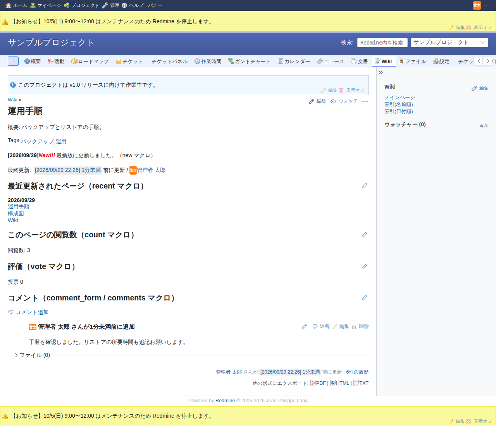

プロジェクト設定の Wiki Extensions タブ（Wiki ページをメニューのタブとして追加）:

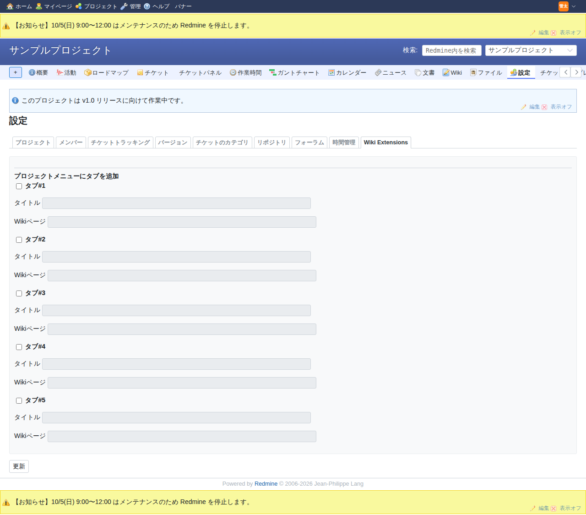

---

## 12. redmine_solid_queue

| 項目 | 内容 |
|---|---|
| プラグインタイトル | Redmine Solid Queue plugin |
| リポジトリ | <https://github.com/nishidayuya/redmine_solid_queue> |
| 導入プラグインバージョン | 7 系: **1.0.0** / 6 系: 1.0.0 / 5 系: **同梱なし**（solid_queue gem が Rails 7 以上を要求し、Rails 6.1 の Redmine 5.1 では解決不可） |
| 対応 Redmine バージョン | `requires_redmine` の宣言なし・CI なし。依存する solid_queue gem が activerecord 7.1 以上を要求するため、実質 Redmine 6.0 以上（Rails 7.2 / 8.1） |

### 解説

Redmine のバックグラウンドジョブ（メール通知の送信など）を、データベースを使うジョブ
キュー **Solid Queue** で処理するようにします。Redmine 標準の開発・テスト向けアダプタの
代わりに本番向けのキューが使われ、メール送信などが画面の応答を待たせずに非同期で処理
されます。キューのテーブルは Redmine のデータベース（本スタックでは PostgreSQL）に作成
されるため、Redis などの追加サービスは不要です。

- 画面上の操作はありません。管理 → **情報** の「キューアダプターがデフォルト（開発・
  テスト用）以外のものに変更済み」にチェックが付き、「Mailer queue」が
  `ActiveJob::QueueAdapters::SolidQueueAdapter` になっていれば有効です。
- **Puma** で起動している場合は、プラグインがジョブ処理プロセス（supervisor / dispatcher /
  worker）を自動で起動します（`REDMINE_SOLID_QUEUE_DISABLE_PUMA_PLUGIN=1` で無効化可能）。
- Puma 以外のアプリケーションサーバーでは、`plugins/redmine_solid_queue/bin/jobs start`
  で別途ジョブ処理プロセスを起動する必要があります（プラグインの README より）。

> **本スタックでの注意（要確認）**: 7 系の既定は `REDMINE_WEB_SERVER=passenger` です。
> 上記のとおり自動起動は Puma 前提のため、Passenger モードではジョブ処理プロセスが
> 起動せず、キューに積まれたメールが送信されない可能性があります。スクリーンショットの
> 環境（Puma）ではジョブ処理プロセスの起動を確認済みですが、Passenger モードでの動作は
> 未検証です。メール通知を使う場合は、Passenger モードで通知メールが実際に届くことを
> 確認するか、`REDMINE_WEB_SERVER=puma` での運用を検討してください。

### スクリーンショット

管理 → 情報（Mailer queue が SolidQueueAdapter になっています。下部には同梱プラグインと
その版の一覧も表示されます）:

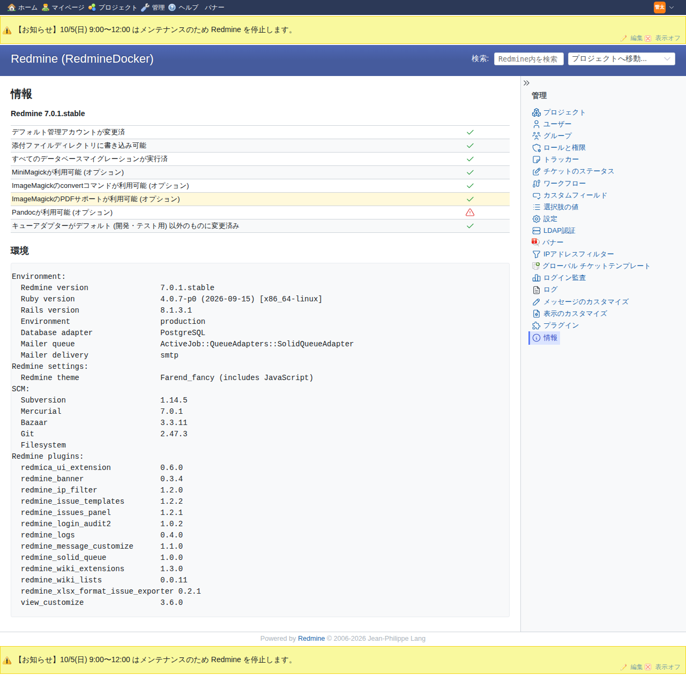

---

## 13. redmine_gtt

| 項目 | 内容 |
|---|---|
| プラグインタイトル | Redmine GTT plugin（Geo-Task-Tracker） |
| リポジトリ | <https://github.com/gtt-project/redmine_gtt> |
| 導入プラグインバージョン | 7 系: **7.1.0**（リリース tarball）/ 6 系: 7.1.0 / 5 系: 6.0.3 |
| 対応 Redmine バージョン | 7.1.0 は `requires_redmine 6.0.0` 以上、Ruby 3.3 以上。CI マトリクスに Redmine 6.0 / 6.1 / 7.0 と Ruby 3.4 / 4.0 が含まれています。**PostgreSQL + PostGIS が必須**（SQLite / MySQL では動作しません） |

### 解説

チケットに **位置情報（点・線・多角形）** を持たせ、地図上で表示・絞り込みできるように
する地理空間プラグインです。本スタックが DB に PostGIS を使い、データベースアダプタを
`postgis` にしているのはこのプラグインのためです（[Design.md](Design.md) 参照）。

- チケットの作成・編集画面に地図が表示され、位置を描画して登録できます。
- チケット一覧の上部に地図が表示され、位置でチケットを確認できます。GeoJSON 形式での
  出力にも対応します。
- プロジェクトに対象エリア（範囲）を設定できます。
- ユーザーの位置を保存できます。
- 地図の背景（タイルレイヤー）は 管理 → **地図レイヤー** で登録し、プロジェクトの設定で
  使用するレイヤーを選びます。地図の既定値（初期表示位置など）は 管理 → **地図の設定** で
  設定します。
- REST API で位置情報を扱えるように拡張されます。ジオコーディングにも対応します。
- 有効化: プロジェクトの設定 → モジュールで「GTT」を有効にします。

> 5 系 → 6 系 / 7 系で 6.0.3 から 7.1.0 に上がるため、MDI グリフを直接指定していた
> トラッカーアイコンは既定マーカーに戻ります。管理画面のトラッカー設定で選び直して
> ください（[Manual.md](Manual.md) 参照）。

### スクリーンショット

以下はプラグインのリポジトリ（v7.1.0）の `doc/` に同梱されている公式スクリーンショットです
（英語表示）。

地図付きのチケット一覧:

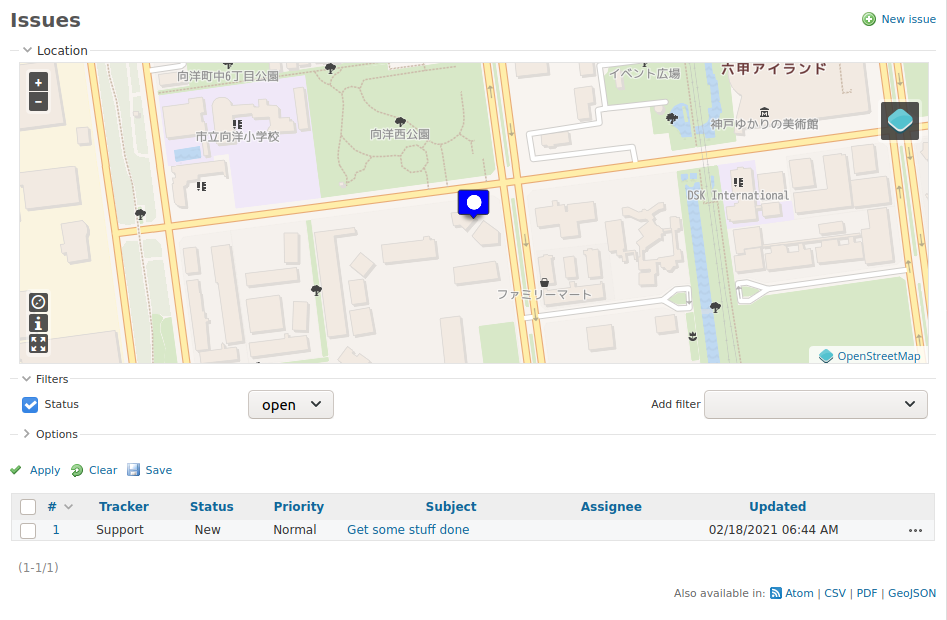

位置情報付きのチケット:

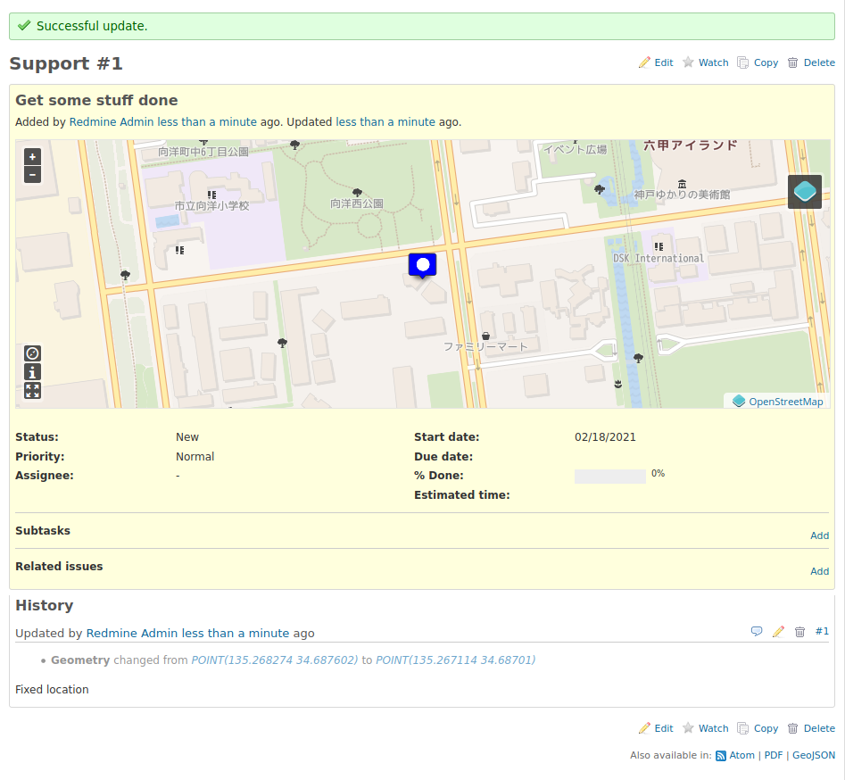

プロジェクト設定（エリア・地図レイヤーの設定）:

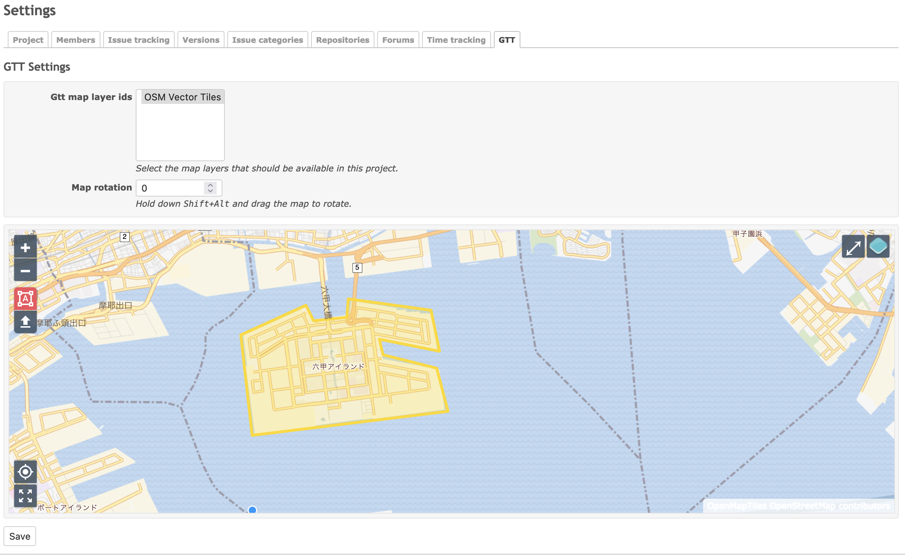

---

## 14. redmine_xlsx_format_issue_exporter

| 項目 | 内容 |
|---|---|
| プラグインタイトル | Redmine XLSX format issue exporter |
| リポジトリ | <https://github.com/two-pack/redmine_xlsx_format_issue_exporter> |
| 導入プラグインバージョン | 7 系: **0.2.1** / 6 系: 0.2.1 / 5 系: 0.2.1 |
| 対応 Redmine バージョン | `requires_redmine 4.2` 以上（上限なし）。最終タグは 2024-01 で、6 系 / 7 系の CI 実績はありません |

### 解説

一覧画面の右下「他の形式にエクスポート」に **XLSX** のリンクを追加し、Excel 形式
（.xlsx）でダウンロードできるようにします。CSV と違って文字コードの変換が不要で、
日本語もそのまま Excel で開けます。

対象画面:

- チケット一覧
- 作業時間
- ユーザー（管理画面）
- プロジェクト一覧

リンクをクリックすると、CSV 出力と同じようにエクスポートのダイアログが開き、
オプションを指定してダウンロードできます。

### スクリーンショット

チケット一覧の右下に「XLSX」リンクが追加されています:

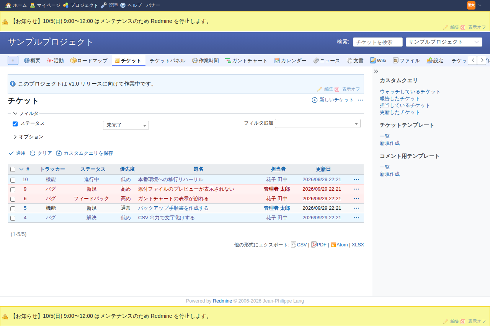

---

## 15. redmine_cascading_custom_fields

| 項目 | 内容 |
|---|---|
| プラグインタイトル | Redmine Cascading Custom Fields |
| リポジトリ | <https://github.com/cerqueirav/redmine_cascading_custom_fields> |
| 導入プラグインバージョン | 7 系: **v0.2.0** / 6 系・5 系: 非同梱 |
| 対応 Redmine バージョン | `requires_redmine 4.2` 以上（上限なし）。README の動作確認対象は 4.2〜6.1 で、Redmine 7 は上流で未確認。本リポジトリでは `redmine:7.0.2` の実機で動作を確認しています |

### 解説

カスタムフィールドの形式に **リスト（カスケード）** を追加します。親フィールド（リスト、または別の
リスト（カスケード））で選んだ値に応じて、子フィールドの選択肢が絞り込まれます
（例: 地域 → 県 → 市）。DB マイグレーションも追加の gem もなく、設定は標準のカスタムフィールド
設定（`custom_fields.format_store`）に保存されます。

使い方:

1. 管理 → カスタムフィールド → 新しいカスタムフィールド で、親にする **リスト** を作ります（例: 地域）。
2. 子のフィールドを **リスト（カスケード）** 形式で作り、選択肢をすべて登録して **親フィールド** を選びます。
3. 「依存関係」で親の値ごとに、選択できる子の値にチェックを付けて保存します。
4. 任意: 「選択肢がない場合は非表示」をオンにすると、親が未選択、または選んだ親の値に紐づく子の値がない間は、
   チケットのフォームでその項目を隠します（隠れている間は必須扱いになりません）。

動作（Redmine 7.0.2 の実機で確認した結果）:

- 親が未選択の間、子に選べる値はありません。
- 親を選ぶと、子には紐づく値だけが選べます（それ以外はドロップダウンで非表示）。
- 親を変えると、新しい親では使えない子の値は自動でクリアされます。
- チケットのトラッカー変更などによる再描画（Ajax）の後も、選択値と絞り込みは保たれます。
- サーバー側でも検証されるため、JavaScript を回避して不正な組合せ（例: 関東 / 大阪）を送ると保存できません。
- 一括編集、チケット一覧のフィルタ・列、CSV 出力、右クリックメニューでも利用できます。
- 親を 1 つ共有する子を複数、同じチケットに並べられます。

注意:

- 親子の組合せに合わない過去のチケットの値は、カスケード項目を変更しない限り、そのまま編集できます（上流 README の仕様）。
- 同等の機能を持つ別プラグイン `redmine_depending_custom_fields` から移行するための rake タスク
  （`redmine:cascading_custom_fields:migrate_from_depending`）が付属します。

### スクリーンショット

チケットの新規作成フォーム。親フィールド「地域」を選ぶと、子フィールドの選択肢が絞り込まれます
（検証用データの画面で、「県(cascading)」が本プラグインのフィールドです。「県(depending)」は比較のために並べた別プラグインのフィールドです）:

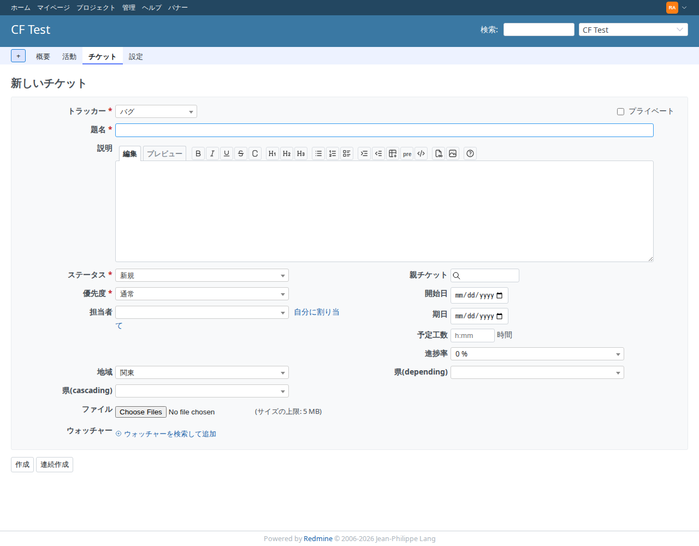

カスタムフィールドの編集画面。親フィールドの指定と、親の値ごとの「依存関係」の設定です:

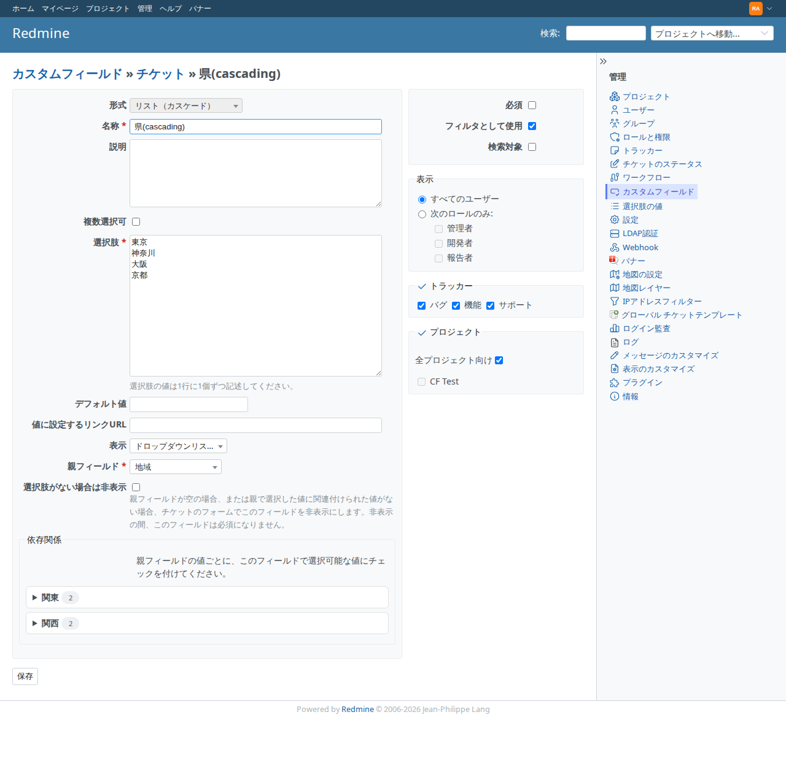

---

## テーマ: farend_fancy

| 項目 | 内容 |
|---|---|
| テーマ名 | farend fancy |
| リポジトリ | <https://github.com/farend/redmine_theme_farend_fancy> |
| 導入バージョン | 7 系: **master** / 6 系: master / 5 系: tag `redmine5.1`（`public/themes/` に配置） |
| 対応 Redmine バージョン | master は Redmine trunk に追従（Redmine 6.0 以降はテーマの配置先が `themes/`） |

### 解説

ファーエンドテクノロジー社の Redmine クラウドサービス「My Redmine」用に開発されたテーマです。
主要なタブやリンクにアイコンが付き、親しみやすい画面になります。メニューの位置や配色は
標準テーマに近いため、標準テーマに慣れた利用者も違和感なく使えます。

適用方法: 管理 → 設定 → 表示 の「テーマ」で **Farend fancy** を選択します
（イメージに同梱しているだけで、既定では適用されていません）。

### スクリーンショット

プロジェクトの概要画面（このドキュメントのスクリーンショットはすべてこのテーマで撮影しています）:

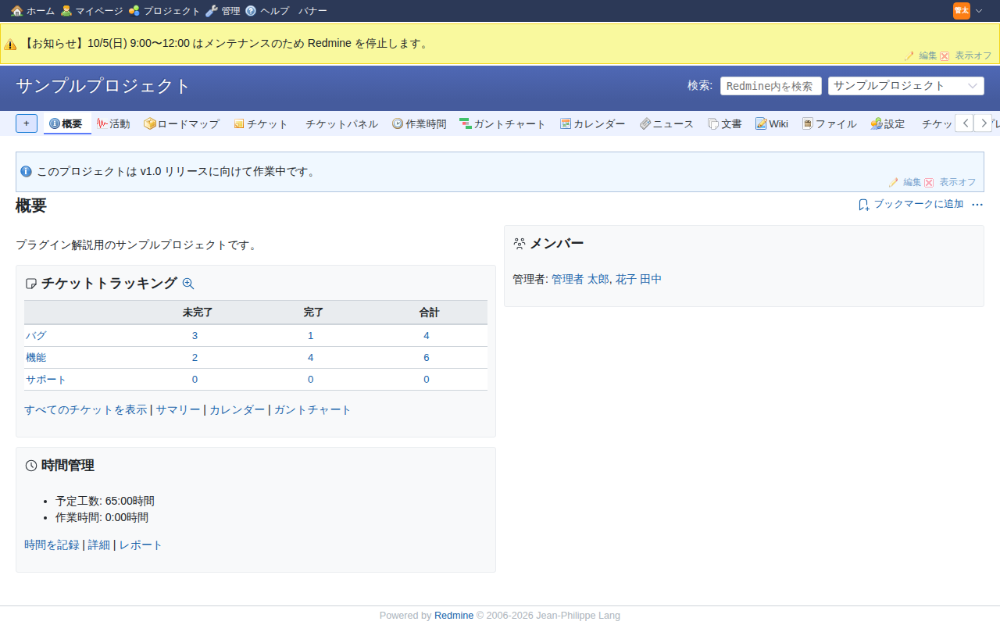
